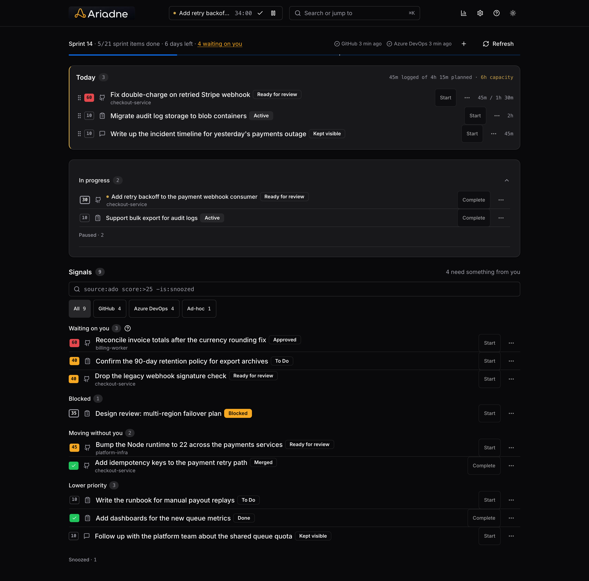
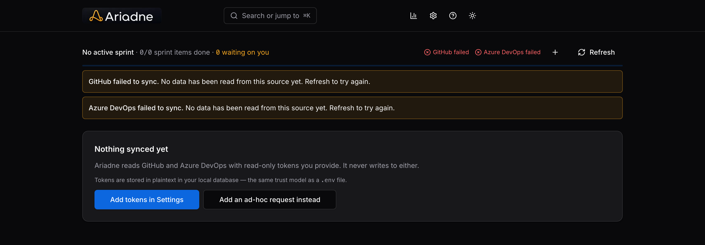

<p align="center">
  
</p>

<h1 align="center">Ariadne</h1>

<p align="center"><em>The anti-autopilot: a transparent, read-only thread through your GitHub,<br>Azure DevOps, and ad-hoc work signals, not an algorithm that runs your day.</em></p>

A personal, local-only dashboard that pulls GitHub (PRs, review requests,
mentions), Azure DevOps (assigned work items, comments, sprint iterations),
and ad-hoc requests (face-to-face, email, Teams) into one ranked view,
tracks sprint progress, and lets you pick what you're working on and log
time against it. No other personal tool combines all three.

Single-user, runs on your machine only. GitHub and Azure DevOps access is
read-only, Ariadne never writes back to either system.



## Philosophy

Ariadne's job is to give you a clear, at-a-glance overview of your work and
the mental space to process it, not to manage your calendar or decide what
you should do next.

- **Personal, local-only, single-user.** No account, no cloud sync, no
  multi-tenant backend, just a SQLite file on your machine.
- **Read-only, always.** Ariadne never writes back to GitHub or Azure
  DevOps. Actions like Start/Complete, even when they cascade to linked
  items, only ever touch Ariadne's own local `items` table.
- **Transparent, not AI-driven.** Urgency is a deterministic, visible point
  formula (own PR approved, mentioned, stale, due soon, ...), not an opaque
  ML ranking. The whole scoring table lives in `lib/scoring.ts`, readable
  end to end, and every score chip on the dashboard opens to show exactly
  which rules fired and which didn't.
- **You control your time, not the algorithm.** There's no auto-scheduling
  of your day and no calendar it rearranges for you. Ariadne surfaces
  signals; you decide what to work on and when.
- **Deliberately small surface.** One dashboard route plus Settings. New
  features are scoped tightly, and real tradeoffs are accepted explicitly
  rather than hidden. For example, access tokens are stored in plaintext
  locally, the same trust model as a `.env` file.

## Stack

- Next.js (App Router, TypeScript), one app for frontend and API routes
- React + Tailwind CSS + shadcn/ui components
- SQLite (`better-sqlite3`) for local storage, no separate database server
- Vitest for tests

## Getting started

```bash
npm install
npm run dev
```

The app runs at `http://127.0.0.1:3000`. On first run, open **Settings** to
add your GitHub and Azure DevOps personal access tokens (read-only scopes).
These are stored locally in the SQLite `settings` table, not in environment
variables.



Data refresh is manual: use the **Refresh** button on the dashboard to pull
the latest PRs, work items, and sprint status.

## Self-hosting with Docker

```bash
docker compose up
```

This builds the image and starts Ariadne at `http://127.0.0.1:3000`. The
SQLite database lives at `./data/ariadne.db` on the host (via a bind mount),
so it persists across container restarts and rebuilds.

By default the port is only published on the host's loopback interface
(`127.0.0.1`), matching Ariadne's local-only philosophy. If you want to
reach it from other devices on your network, change the port mapping in
`docker-compose.yml` from `"127.0.0.1:3000:3000"` to `"3000:3000"`.

Without compose:

```bash
docker build -t ariadne .
docker run -d -p 127.0.0.1:3000:3000 -v $(pwd)/data:/data \
  -e ARIADNE_DB_PATH=/data/ariadne.db ariadne
```

## Scripts

| Command | Description |
|---|---|
| `npm run dev` | Start the dev server |
| `npm run build` | Production build |
| `npm run start` | Run the production build |
| `npm test` | Run the test suite (Vitest) |

## Data

All data lives in a local SQLite file (`ariadne.db` by default,
configurable via `ARIADNE_DB_PATH`). Ad-hoc requests (face-to-face,
email, Teams) can be added directly from the dashboard alongside synced
GitHub/ADO items.
